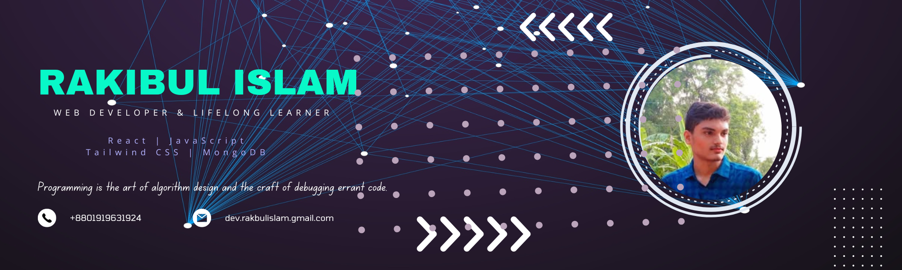

  

  

<h1 align="center">Rakibul Islam</h1>
<h3 align="center">Passionate Web Developer & Learner</h3>

  <strong>Location:</strong> Mymensingh, Dhaka &nbsp; | &nbsp<strong>Email:</strong> <a href="mailto:dev.rakibislam@gmail.com
">dev.rakibislam@gmail.com</a>

----

## 👋 About Me

I’m Rakibul, a dedicated web developer from Bangladesh passionate about building modern, responsive websites and exploring cutting-edge web technologies.

- Currently exploring **Next.js** and **React**
- Improving skills in **MongoDB** and **Firebase Cloud Functions**
- Enthusiastic about learning **OS development** alongside web development

---

## 💻 Tech Skills

  
  
  
  
  
  
  
  
  

---

## 🌐 Find Me On

  
  
  
  

---

## 📈 GitHub Stats

  

---
